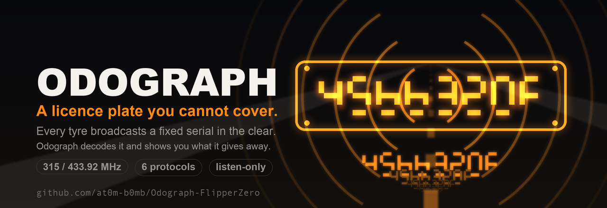
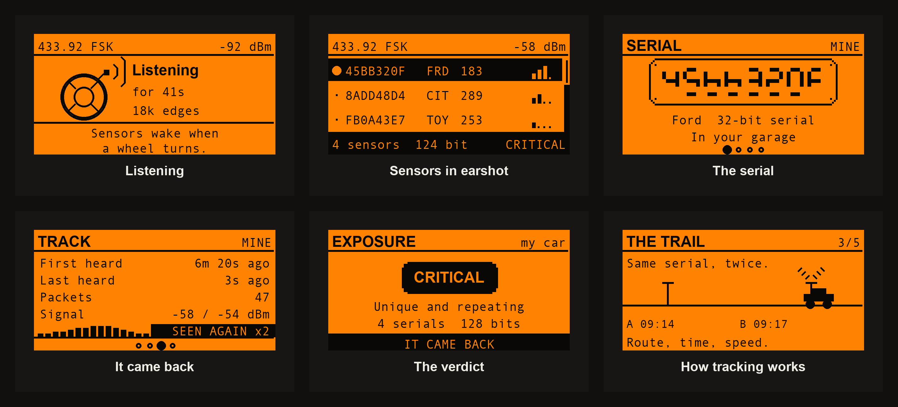
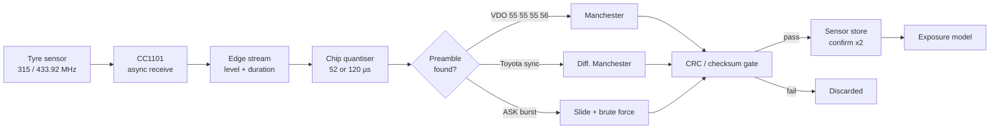
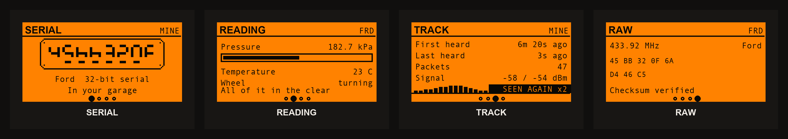
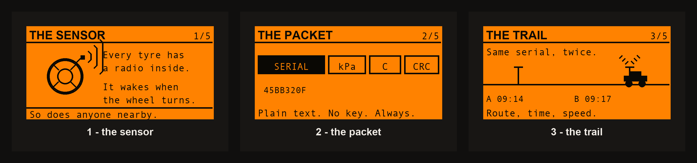

<div align="center">



# Odograph

**A licence plate you cannot cover.**

Every tyre on a modern car carries a pressure sensor with a permanent serial number, and it broadcasts that serial in the clear whenever the wheel turns. Odograph listens, decodes it, and shows you exactly how identifying it is.

[](https://github.com/at0m-b0mb/Odograph-FlipperZero/actions/workflows/build.yml)


-8a2be2)


</div>

---

## The problem nobody mentions

Since 2007 in the United States and 2014 in the European Union, every new passenger car has been required to monitor its own tyre pressure. Almost all of them do it the same way: a battery-powered sensor bolted to each valve stem, transmitting on 315 MHz or 433.92 MHz.

Each of those sensors has a **fixed 24- to 32-bit serial number**. It is sent in every packet, in plain text. It is not encrypted, it is not rotated, it is not paired to anything you control, and there is no setting anywhere in the car that turns it off.

That means your car answers to a unique radio identity, continuously, from a hundred metres away, through walls, without a camera and without a number plate ever being visible.

**Odograph is the tool that shows you this is true, on your own car, in about a minute.**

<div align="center">



*Listening · sensors in earshot · the serial as a plate · proof it came back · the verdict · how tracking works*

</div>

---

## What it actually does

- **Listens** on 315 / 433.92 / 434.10 MHz for tyre-pressure transmissions, FSK and ASK.
- **Decodes** the sensor serial, tyre pressure, temperature and motion flag from six protocol families.
- **Confirms** before it names anything: a serial has to decode cleanly twice before Odograph will show it to you. Checksum collisions do not survive that.
- **Scores the exposure**: how many bits of identity are on the air, and how many of the world's ~1.5 billion cars would answer to the same fingerprint.
- **Remembers your car**. Save a serial to the garage and Odograph recognises it days later — the single most convincing demonstration there is, because you watched it happen.

It never transmits. There is no TX path compiled into the application at all.

---

## The exposure model

This is the part that turns a hex dump into a point.

| Sensors decoded | Identity on air | Other cars on earth that match |
|---:|---:|---|
| 1 (24-bit Renault) | 24 bits | ~88 |
| 1 (28-bit Schrader) | 28 bits | ~4 |
| 1 (32-bit Ford) | 32 bits | none |
| 2 | 56–64 bits | none, by a factor of billions |
| 4 (a whole car) | 96–128 bits | none, ever |

One wheel already narrows you to a handful of vehicles worldwide. **Two wheels make you unique.** A whole car is unique by a margin so large the number stops meaning anything — and it re-announces itself every time you drive.

Odograph reports this as a level:

| Level | What it means |
|:---:|---|
| **NONE** | Nothing decoded |
| **LOW** | Something is transmitting, but no serial could be read |
| **MODERATE** | One readable serial — narrowed to a few cars |
| **HIGH** | Several — unique in any realistic population |
| **CRITICAL** | A full set, or a serial that came back after a gap |

Hearing the same serial return after a gap promotes the level by a full step, because that is no longer a reading — it is a handle that keeps working.

---

## Protocols

| Family | Modulation | Serial | Integrity | Seen on |
|---|---|---:|---|---|
| **Ford** | FSK, 52 µs Manchester | 32-bit | sum-8 | Ford, Lincoln |
| **Renault** | FSK, 52 µs Manchester | 24-bit | CRC-8 `0x07`/`0x00` | Renault, Dacia |
| **Citroën** | FSK, 52 µs Manchester | 32-bit | XOR | Citroën, Peugeot, Fiat |
| **Hyundai / Kia** | FSK, 52 µs Manchester | 32-bit | CRC-8 `0x07`/`0xaa` | Hyundai, Kia, VDO |
| **Toyota** | FSK, 52 µs diff. Manchester | 32-bit | CRC-8 `0x07`/`0x80` | Toyota, Lexus |
| **Schrader** | ASK, 120 µs Manchester | 28-bit | CRC-8 `0x07`/`0xf0` | GM, Opel, Nissan |

Anything that is clearly a tyre sensor but matches none of these is reported as an **unrecognised fingerprint** — a stable hash of the bytes where TPMS protocols overwhelmingly keep their serial. It is labelled as a heuristic, it contributes **zero** bits to the exposure score, and it must be heard twice before it is listed at all.

Field layouts and checksum polynomials are documented in [PROTOCOLS.md](PROTOCOLS.md), with per-protocol citations to the public rtl_433 protocol descriptions. The implementation is original.

---

## How it works



Both FSK polarities are tried on every burst, because whether the CC1101's discriminator hands us a sensor's "1" the right way up is not knowable in advance. The packet's own CRC settles it.

---

## Getting a decode

Tyre sensors are quiet on purpose — their batteries have to last a decade.

- They transmit **when the wheel turns**, and roughly **once a minute at rest**.
- Park beside a road and wait, or roll your own car forward a few metres.
- **Band matters.** 433.92 MHz for most of the world, 315 MHz for North America and Japan.
- If the edge counter is climbing but nothing decodes, the radio is hearing *something* — try the other band, or switch **FSK** to **FSK+**.

**FSK** uses the firmware's stock wideband preset, which is what every Flipper captures raw FSK with. **FSK+** is a TPMS-tuned register set: 19.2 kBaud, a 203 kHz channel filter and 38 kHz deviation, computed for what these sensors actually send. FSK+ should be more sensitive; FSK is the more conservative bet. If one will not decode your car, try the other.

---

## Controls

| Screen | Keys |
|---|---|
| **Listen** | Up/Down pick a sensor · OK opens it · Right jumps to the report · Left steps the band |
| **Sensor** | Left/Right page through SERIAL → READING → TRACK → RAW · OK saves to the garage |
| **Report** | Left/Right page · OK switches between everything heard and your car only |
| **How this works** | Left/Right step the five frames |

<div align="center">





</div>

---

## Install

Grab `odograph.fap` from the [latest release](https://github.com/at0m-b0mb/Odograph-FlipperZero/releases/latest) and drop it in `SD/apps/Sub-GHz/` on your Flipper. It appears under **Apps → Sub-GHz → Odograph**.

Or build it yourself:

```bash
ufbt
```

Odograph targets the **official firmware, API 87.1**, and needs no external hardware — the internal CC1101 does all of it.

---

## Tests

The decode engine is pure logic and runs on the host:

```bash
make -C test
```

140 checks over both suites. The Schrader vector and its CRC byte come straight from the published rtl_433 protocol description, so it validates the CRC-8 implementation against something Odograph did not write. The Ford, Citroën, Renault and Toyota payloads are reconstructed from the decoded values rtl_433 reports for **real off-air captures** in its test corpus, so the physical readings Odograph prints have to match what a known-good decoder saw on the air.

There is also a noise suite: 400 bursts of random edges, at both chip rates, must produce **zero** named protocols.

---

## Honest limits

- **Not field-verified against every listed protocol.** The decoders are validated against real captures through rtl_433's corpus and against their own checksums, and the demodulator is tested against jittered edge streams — but I have not personally held a Toyota, a Renault and a Citroën in front of it. If one does not decode for you, open an issue with the band, the profile and the edge count.
- **Sensors we cannot name are a heuristic, not a decode.** The fingerprint is a hash of payload bytes; if a protocol keeps state in those bytes it will drift. That is why it never counts toward the exposure score.
- **The exposure arithmetic assumes serials are uniformly distributed.** They are not, entirely — manufacturers allocate in blocks. The real figures are worse than the ones shown, not better.
- **This does not read a moving car at motorway speed from a bridge.** It is a bench and kerbside tool.

---

## Use it on your own vehicle

Or with the owner's permission. Tracking someone else's car is illegal in most jurisdictions, and this application exists to show you that the capability is sitting in the open — not to hand it to anyone. Odograph is listen-only by construction: it cannot spoof a sensor, cannot trigger a warning light, and cannot change what anyone's dashboard says.

---

## Licence

MIT. See [LICENSE](LICENSE).

Protocol descriptions referenced from the [rtl_433](https://github.com/merbanan/rtl_433) project's public documentation and test corpus, with thanks — the implementation here is original.

<div align="center">

**by [at0m-b0mb](https://github.com/at0m-b0mb)**

</div>
